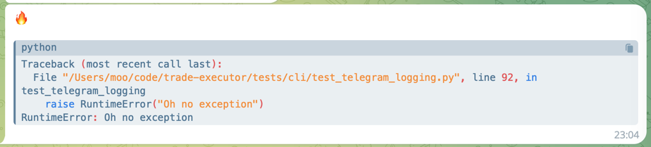

# Telegram Bot Logger

[](https://pypi.org/project/telegram-bot-logger/)
[](https://pypi.org/project/telegram-bot-logger/)

Telegram Bot Logger is a Python library that allows you to send logging logs to Telegram using the Bot API. It simplifies the process of integrating Telegram bot notifications into your Python applications, making it easy to monitor and manage your application's logs.


## Installation

You can install `telegram_bot_logger` using pip:

```bash
pip install telegram-bot-logger
```


## Usage

Replace `YOUR_BOT_TOKEN` and `chat_ids` with your actual bot token and chat IDs. You can obtain a bot token by creating a new bot on Telegram and obtaining it from the [BotFather](https://t.me/BotFather).

```python
import telegram_bot_logger

import logging


logger = logging.getLogger("telegram_bot_logger_example")

handler = telegram_bot_logger.TelegramMessageHandler(
    bot_token = "YOUR_BOT_TOKEN",  # Required; bot's token from @BotFather
    chat_ids = [
        12345678,
        -1001234567890,  # For group chat id, make sure you pass the chat id as integer
        "@username"
    ],  # Required; you can pass id as integer or username as string
    api_server = telegram_bot_logger.api_server.TelegramAPIServer(
        base = "https://api.telegram.org/bot{bot_token}/{method}"
    ),  # Optional; set by default
    format_type = "text" or "TEXT" or telegram_bot_logger.formatters.FormatType.TEXT,  # Optional; also can be "DOCUMENT", by default it is "TEXT"
    document_name_strategy = "timestamp" or "TIMESTAMP" or telegram_bot_logger.formatters.DocumentNameStrategy.TIMESTAMP,  # Optional; used to define documents' names; also can be "ARGUMENT", by default it is "TIMESTAMP"
    proxies = {
        "http://": "http://localhost:8080"
    } or "http://localhost:8080",  # Optional; "dict[scheme, url]" or just "url", please see httpx's supported proxy types
    formatter = formatters.TelegramHTMLTextFormatter(),  # Optional; you can create your own class inherited from formatters.TelegramBaseFormatter and pass it
    additional_body = {
        "reply_to_message_id": 1
    }  # Optional; additional request body on sendMessage and sendDocument
)

logger.setLevel(logging.DEBUG)

logger.addHandler(handler)


logger.debug("debug-message")
# Or:
logger.debug("debug-message", extra={"document_name": 123})  # 123 is an argument; to use this feature you need to set `format_type = formatters.FormatType.DOCUMENT` and `document_name_strategy = formatters.DocumentNameStrategy.ARGUMENT` while initiating TelegramMessageHandler
```

It is highly recommend using string formatters in log messages, as these are not expanded if the logging level is not high enough,
making difference in performance critical applications:

```python
# Use string formatter to avoid formatting an excessive log message argument 
long_list = list(range(1000))
logger.info("My long list is: %s", long_list)
```

You can also show tracebacks:

```python
try:
    raise RuntimeError("Ooops I did it again")
except Exception as e:
    logger.exception(e)
```



## Closing the handler

This logging handler creates a daemon background thread, as it uses Python's internal [QueueHandler](https://docs.python.org/3/library/logging.handlers.html#queuehandler). The thread is closed with Python's `atexit` handler. However for some applications, like pytest, to cleanly shut down, you may need to shutdown the handler manually.

```python
# Release any background threads created by the Telegram logging handler
handler.close()
```

## More examples

Here is an example how to customise Telegram output a bit:

```python
import logging
import telegram_bot_logger
from telegram_bot_logger.formatters import TelegramHTMLTextFormatter

# Fine tune our Telegram chat output
formatter = TelegramHTMLTextFormatter()
formatter._EMOTICONS[logging.DEBUG] = "📜"  # Patch in the emoticon by logging level
formatter._TAG_FORMAT = ""  # Disable tags in the output
formatter._HEADER_FORMAT = "<pre>{emoticon} {message}{description}</pre>"  # Disable line number and module name in the output

telegram_handler = telegram_bot_logger.TelegramMessageHandler(
    bot_token = "YOUR_BOT_TOKEN",
    chat_ids = [
        -1001234567890,
    ],
    format_type = "text",
    formatter = formatter,
    level = logging.INFO
)

logging.getLogger().addHandler(telegram_handler)
```

## Stay Updated

For the latest news and updates, follow my [Telegram Channel](https://aryn.sek.su/tg/dev).
